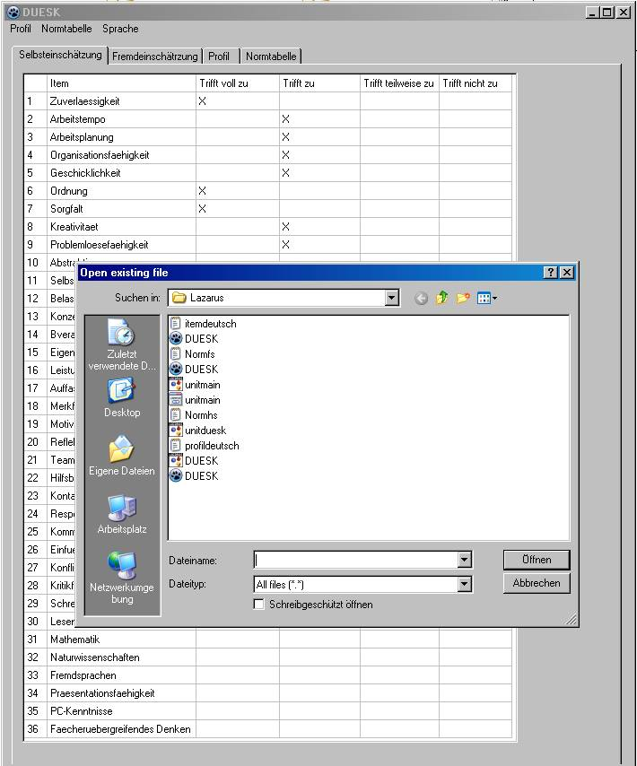

# duesseldorfer-schuelerinventar-spss-R
SPSS R
# duesseldorfer-schuelerinventar
GERMAN
Quelloffenes Persönlichkeitsinventar

Seit 2012 dient das quelloffene Düsseldorfer Schülerinventar als Lernumgebung für Studenten der Sozialwissenschaften und Auszubildende der 
Markt- und Sozialforschung, der Anwendungsentwicklung und der Daten- und Prozessanalyse.

Das Düsseldorfer Schülerinventar ist ein offenes, gültiges, genaues und unabhängiges Persönlichkeitsinventar für Schüler 
der Übergangsklassen (valide, reliabel, objektiv). Das Düsseldorfer Schülerinventar ist entwicklungsoffen. 
Wenn Sie an einem Open-Source-Projekt mitwirken, kennen Sie das intensive, persönliche Engagement, das zum Gelingen beiträgt. 
Viele Nutzer wissen und schätzen das. Aus der eigenen Kraft der Entwickler gelingt aber nicht alles, 
zumal vielfach nur das pure Interesse am Thema oder der Umgang mit Technologien die Basis abgibt. 
Nicht jeder Nutzer verfügt jedoch über die Fähigkeiten und die Zeit, um ein Projekt zu unterstützen. 
Verbales Feedback in Form von Fehlermeldungen ist sehr hilfreich. Für andere kann eine materielle Unterstützung die einzige Möglichkeit sein, 
sich an Open Source zu beteiligen. Gerne spreche ich mit Ihnen über Ihre Art der Unterstützung.

Ich freue mich über wissenschaftliche Reanalysen und weitere Entwicklungsteams. Gerne stelle ich zu wissenschaftlichen 
Zwecken die SPSS- und R-Dateien zur Verfügung. Zur Weiterentwicklung stelle ich gerne die Quellcodes der Programme zur Verfügung 
(PHP, MySQL, Xcode, Android Studio, Xamarin, Lazarus).

ENGLISH
Open source personality inventory Since 2012, the Düsseldorf school inventory, which is open source, has served as a learning environment for social science students and trainees at Market and social research, application development and data and process analysis. The Düsseldorf student inventory is an open, valid, precise and independent personality inventory for students of the transition classes (valid, reliable, objective). The Düsseldorf student inventory is open to development. If you are involved in an open source project, you know the intense, personal commitment that makes it a pleasure to succeed. Many users know and appreciate this. However, not everything can be achieved using the developers' own strength. especially since only the pure interest in the topic or the handling of technologies provides the basis. However, not every user has the skills and the time to support a project. Verbal feedback in the form of error messages is very helpful. For others, material support can be the only option participate in open source. I would be happy to talk to you about your type of support. I look forward to scientific reanalyses and further development teams. I am happy to provide scientific Purpose of the SPSS and R files available. I am happy to provide the source code of the program for further development (PHP, MySQL, Xcode, Android Studio, Xamarin, Lazarus). 

#The calibration sample is made up of students from the German education system with German language skills. A translation of the items formulated in German into another language only makes sense if a new calibration sample is drawn for this language and the educational system there.

Die Algorithmisch rekursive Sequenzanalyse ist das einzige mir bekannte objektiv hermeneutische Verfahren, dass vollständig ohne esoterische Tiefenhermeneutik auskommt, algorithmisch, evolutionär und memetisch ausgerichtet ist und einen Grammatikinduktor (Scheme) , einen Parser (Pascal) und einen Grammatiktransduktur (Lisp) bietet. 

Das Düsseldorfer Schülerinventar ist das einzige mir bekannte quelloffene, valide, reliable und objektive Verfahren, dessen Quellen und Quellcodes überschaubar und nachvollziehbar nachprogrammierbar sind.

Ich freue mich über Erben, die die Verfahren aufgreifen, nachprogrammieren und/oder für Eigenentwicklungen davon inspirieren lassen.

The algorithmic recursive sequence analysis is the only objective hermeneutic method known to me that does not require any esoteric deep hermeneutics, is algorithmically, evolutionarily and memetically oriented and offers a grammar inductor (Scheme), a parser (Pascal) and a grammar transductor (Lisp).

The Düsseldorf student inventory is the only open-source, valid, reliable and objective method that I know of, whose sources and source codes are clear and understandable and can be reprogrammed.

I am happy about heirs who take up the process, reprogram it and/or let it inspire them for their own developments.
